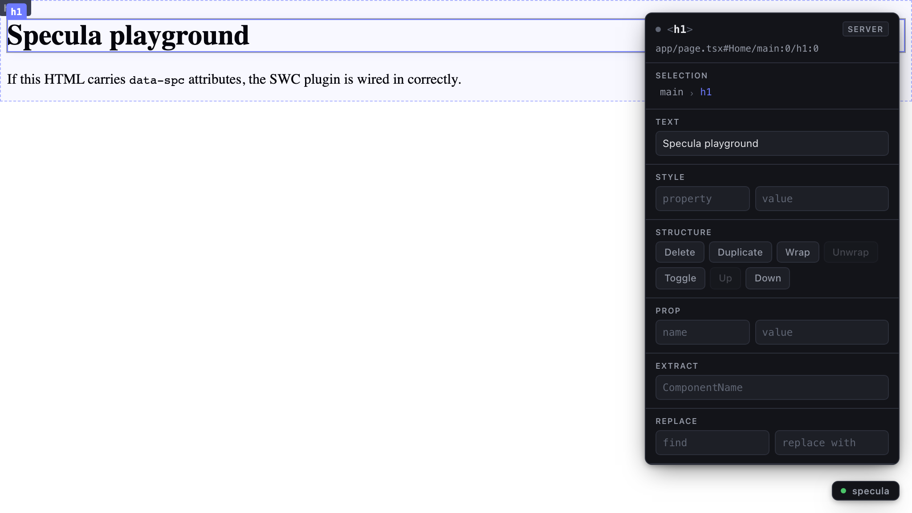

# Specula

**Specula is a visual source editor for Next.js. Click a live page. Edit the
real source. Keep the diff tiny.**

Click an element in your running app. Edit its text, its Tailwind classes, an
inline style, or swap an image. Specula writes the change back to your source
files as a *minimal diff* — only the bytes you changed move; formatting,
comments, and every other line are preserved exactly.



*The inspector, live over the bundled playground — click an element on the left,
edit it on the right, and the source file changes underneath.*

## Alpha

Specula is in `v1.1.0-alpha`. I am looking for Next.js developers to try the demo, make a few edits, inspect the Git diff, and tell me whether they would trust the result. v1.1 just added six new verbs and four new modalities — arrow-key nudge, style scrubbing, drag-to-reorder, multi-select, set-prop on component instances, and extract-component (multi-file atomic transaction).

Start with the demo below. If the source diff feels wrong, confusing, or unsafe, that is the most valuable feedback.

It is not a design tool that exports code, and not a no-code layer that owns a
separate state. The rendered DOM and the source AST are two views of one
thing; Specula is the bridge between them.

## The invariant

> No Specula transaction leaves you looking at a broken state. Every edit
> either **commits a verified change**, **rolls the file back byte-for-byte**,
> or **commits and surfaces an honest warning** with one-click revert. There
> is no fourth outcome.

"No mistakes" does not mean zero errors — it means **zero silent, irreversible
ones**. Every edit runs as a transaction: staged, applied, gated, and
committed or rolled back. See [`specs/`](specs/) for the frozen contracts this
guarantee is built on.

## What Specula does

| Edit | Verb | How it lands |
|---|---|---|
| Change text | `edit-text` | Optimistic patch, then committed to source |
| Add / remove classes | `set-class` | Tailwind-merged, optimistic, committed |
| Set a style property | `set-style` | Lowered to a Tailwind arbitrary class, optimistic |
| Swap an image | `replace-asset` | Upload written under `public/`, optimistic |
| Edit any JSX prop | `set-prop` | Any attribute — `href`, `alt`, `placeholder`… |
| Delete / duplicate | `delete` · `duplicate` | Committed; Fast Refresh re-renders |
| Wrap / unwrap | `wrap` · `unwrap` | `unwrap` is the byte-for-byte inverse of `wrap` |
| Reorder up / down / drag | `move` | Swap with an adjacent sibling |
| Flip a conditional | `toggle-conditional` | `{test && <el>}` ↔ `{!test && <el>}` |
| Extract a component | `extract-component` | Pulled into its own `.tsx` — multi-file atomic |

The four property edits are **Tier A**: the overlay patches the DOM the instant
the daemon acknowledges, so the change is visible with zero latency while the
real source edit runs behind it. The structural and prop edits are **Tier B** —
no optimistic patch; Next.js Fast Refresh re-renders them once committed.

Several of these have direct gestures on the selected element: arrow keys nudge
a Tailwind margin one step, the mouse wheel scrubs a class chip through its
scale, drag-and-drop reorders siblings, `Cmd`+click multi-selects to apply one
class to many, and a find/replace runs `edit-text` across the selected subtree.

## Requirements

- **Node.js 20.19+**
- **Rust (stable)** with the wasm target — the instrumentation builds from
  source:
  ```sh
  rustup target add wasm32-wasip1
  ```
- For your own project: **Next.js 16 App Router**, the **Webpack** dev runtime
  (`next dev --webpack`), and **Tailwind** — `set-class` and `set-style` edits
  render through Tailwind. The bundled demo is a minimal Next.js 16 + Webpack
  app without Tailwind; it's there to exercise the text and structural edits the
  quick start below walks through.

## Quick start — the demo

From the repo root:

```sh
npm run setup     # install dependencies, build the Rust artifacts + overlay
npm run dev       # start the playground with Specula live
```

`npm run dev` prints a URL. Open it, click the heading, and edit its text in
the inspector panel — then look at `apps/playground/app/page.tsx`: the edit is
already there, as a one-line diff.

`npm run setup` builds a Rust SWC plugin and two native binaries, so the first
run takes a few minutes. After that, `npm run dev` is instant.

## Using Specula in your own project

Specula is not on npm yet (see [known limitations](docs/known-limitations.md)),
so for v1 you point your project at the artifacts in this repo. Two changes:

**1. Add the SWC plugin to `next.config`:**

```js
import { dirname, resolve } from "node:path";
import { fileURLToPath } from "node:url";

const here = dirname(fileURLToPath(import.meta.url));
const speculaPlugin = resolve(
  here,
  "<path-to-specula-repo>/specula-instrument/target/wasm32-wasip1/release/specula_swc_plugin.wasm",
);

export default {
  experimental: {
    // `root` makes the instrumented ids project-relative — no absolute path
    // ever lands in your HTML.
    swcPlugins: [[speculaPlugin, { root: here }]],
  },
};
```

**2. Load the overlay in your App Router root layout (`app/layout.tsx`),
dev-only:**

```jsx
{process.env.NODE_ENV !== "production" && (
  <script
    src={`http://127.0.0.1:${process.env.SPECULA_PORT ?? "5151"}/specula.js`}
    async
  />
)}
```

Then run `specula dev` from your project root. It checks both pieces of wiring
and tells you exactly what is missing if either is absent.

## Repository layout

| Path | What it is |
|---|---|
| `specs/` | The three frozen v1 contracts — identity, protocol, verification |
| `specula-instrument/` | Rust SWC plugin and `analyze` / `edit` CLIs |
| `packages/daemon/` | Transaction lifecycle daemon |
| `packages/overlay/` | Browser overlay, hit-testing, selection ladder, inspector |
| `packages/cli/` | The `specula` command |
| `apps/playground/` | Demo Next.js 16 app |

## Documentation

- **[docs/how-it-works.md](docs/how-it-works.md)** — the click-to-source loop:
  element identity, the protocol, the transaction lifecycle.
- **[docs/known-limitations.md](docs/known-limitations.md)** — what v1
  deliberately does not do, and why.
- **[specs/](specs/)** — the formal, frozen contracts.
